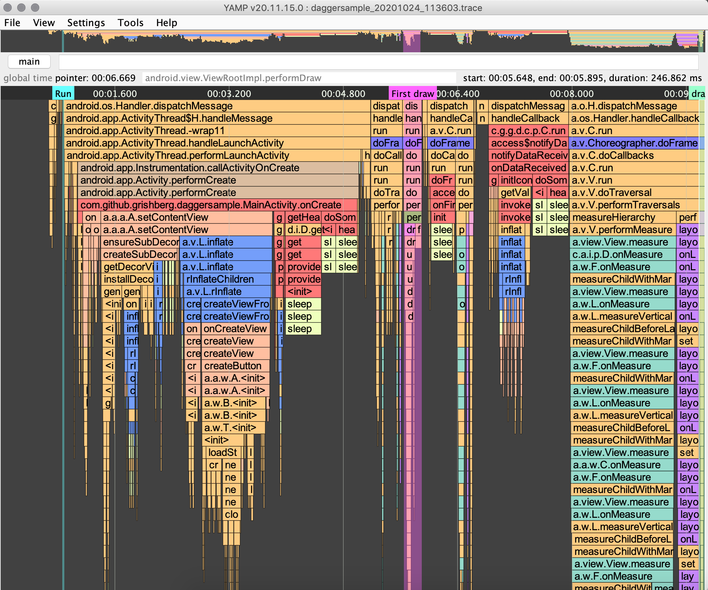
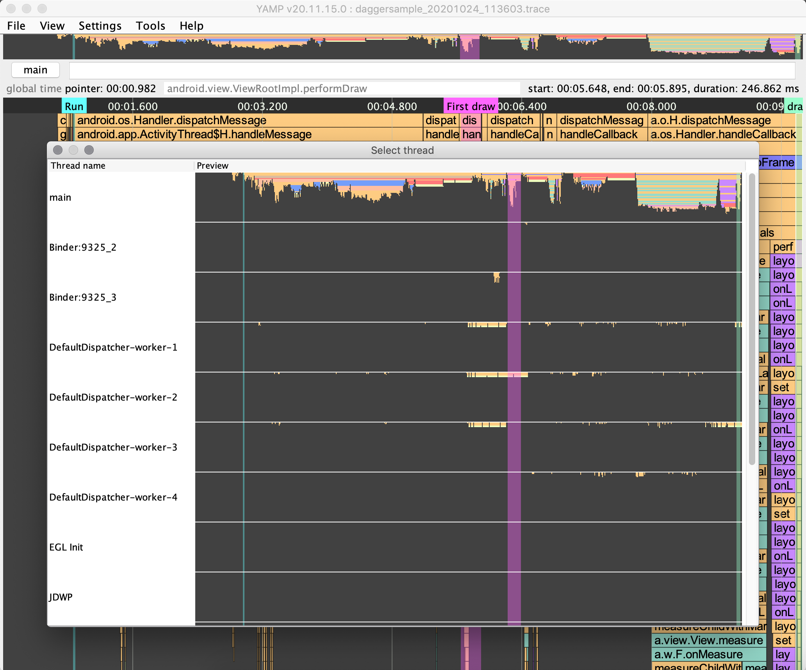
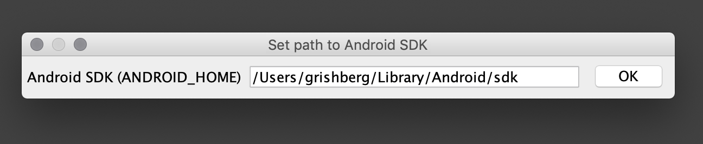

# Yet Another Methods Profiler for Android (YAMP)
This is tool for analyzing method trace files `.trace` files like [Android Profiler](https://developer.android.com/studio/profile/android-profiler) but works faster, has convenient control, user bookmarks and custom highlighting.






For Russian speaking developers there is a video [guide](https://youtu.be/epJNlw6ez-A)

## Download
  
- [Download latest release](https://github.com/Grigory-Rylov/android-methods-profiler/releases)

## Installation
### Mac OS X
1. Open DMG file
2. Drag Android Methods Profiler icon into Applications shurtcut 
3. Open Applications and right mouse click on **Android Methods Profiler** and select "Open" (only first launch)

### Linux
Open terminal and execute `sudo dpkg -i android-methods-profiler_{YOUR_VERSION}_all.deb`

If some older files cannot be overwritten, try `sudo dpkg -i --force-overwrite android-methods-profiler_{YOUR_VERSION}_all.deb`

To launch type in terminal `andoid-methods-profiler` or `yamp`. Or you can open in menu by pressing Meta

## Keymap
Read about keymap [there](docs/KEYMAP.MD)

## Bookmarks
Helps to mark some methods in trace.
Bookmarks are saved automatically after you add new one.
Bookmarks are stored in `$HOME/android-profile-viewer/markers` folder.
The easiest way to add bookmark is to click on the method and press **m** key.
In the opened dialog enter bookmark name and select color.

You can share current opened trace file with your bookmarks in single 
file by `File -> Export trace with bookmarks` or **Ctrl + Shift + e** , 
then select new file name and send single `*.twb` file to anyone 
who has AndroidMethodsProfiler v20.06.22.0 or newer.

`*.twb`file is zip archive with `.trace` and `.marker` files


## New Trace Recording
After first launch you will see **Setup android sdk home** dialog, please 
enter path to Android SDK Home like `$ANDROID_HOME` and it will be stored in settings file



After clicking on *New Trace* icon or pressing *Ctrl + n* record new trace dialog will be opened.
Saved `.trace` files will be placed in `$HOME/android-profile-viewer/trace` folder

In the opened dialog package field is required, activity name is optional.
If you entered activity name then application will start after clicking `Start` button.
If activity field is empty - you need to start application manually, or it can already be running.

Sampling parameter: The lower the value, the more accurate the report will be, but the greater the load on the mobile phone CPU. For old device, like nexus 5X I prefer 1000 microseconds.
 
You can select two record mode: 
- **Sample Java Methods** : Captures your app’s call stack at frequent intervals during your app’s Java-based code execution.
- **Trace Java Methods** : Instruments your app at runtime to record a timestamp at the beginning and end of each method call.

[More information about recording modes](https://developer.android.com/studio/profile/cpu-profiler#configurations)


## Report generator
Generates flat list of methods with duration. Can be filtered by duration and/or is current method constructor.

## Highlighting: 
-  Choreographer.doFrame
-  measuring
-  layouting
-  inflating
-  drawing
-  request layout

Also you can add custom highlighting:
highlighting mapping placed in `$HOME/android-methods-profiler/colors.json`
for example:
```
[
  {
    "filter": "com.example",
    "color": "FF9595"
  }
]
```
will highlight all methods of classes started with `com.example`.

`colors.json` will be created automatically with sample highlighting

## Find class or methods
To find class or method you should press **Ctrl + f** or manually click to searching field.
Type class name and/or method name for example *SomeClass.someMethod* and press **Enter**.  

If current thread data contains any matches to the mask "\*.SomeClass.someMethod.\*" then these elements will be highlighted and the focus will be on the first element found.  

If you want to find methods that ends with *SomeClass.someMethod* then type *SomeClass.someMethod()* and profiler will find any matches to the mask "\*.SomeClass.someMethod".  

If there is no results in current thread, profiler will search it in another threads and ask you to switch to another thread if threre is any results - this can be very useful!

## Settings
Settings are stored in `$HOME/android-methods-profiler/.android-methods-profiler-settings.json`

## Troubleshooting
If you entered activity name in **New trace** dialog and see "Wait for application..." status, but application is started - try to close Android Studio and record again.

To scale application on hi-res displays on linux, try to edit `/opt/android-methods-profiler/app/android-methods-profiler.cfg` and enter `-Dsun.java2d.uiScale=2` below `[JVMOptions]`

<a href="https://www.buymeacoffee.com/grishberg" target="_blank"></a>

# License

YAMP is released under the [Apache License, Version 2.0](LICENSE.txt).
