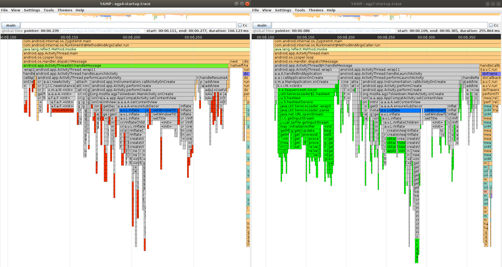
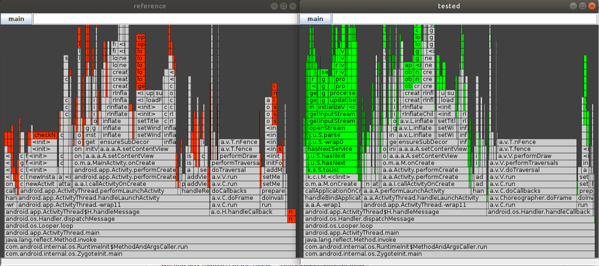

# Trace Comparing

### CURRENTLY NOT AVAILABLE IN PLUGIN VERSION

YAMP has additional launch modes for trace comparing: comparing basic traces and flame-charts and comparing aggregated flame charts.

For Russian speaking developers there is a video [guide](https://youtu.be/re49DY80WDg)

### How to launch comparison of two traces?
1. Launch YAMP with `--cmp` flag
2. In opened window move to `File->Open .trace file` and select **reference** trace
3. Choose method you want to compare by right-click on it and `Compare`
4. Select **tested** trace through dialog

**NOTE:** further you may select methods you want to compare manually. Just `left-click` those methods and `right-click+Compare` on one of the selected methods. This feature also helps when algorithm failed to find automatically method on **tested** trace.

**NOTE:** you also may compare flame charts of selected methods same way. Just do `right-click+Compare flame charts` instead of `right-click+Compare`

**NOTE:** you may launch YAMP like `--cmp <ref.trace> <tested.trace>`. Then 2 windows will be opened with root methods on main thread compared.

### What the colors mean?
- **Grey** for compared methods but not changed its behaviour
- **Bright green** for *new* methods (presented on **tested** but not on **reference**)
- **Red** for *old* methods (presented on **reference** but not on **tested**)
- **Blue** for methods changed their execution order
- Not comparable methods don't have specific color

### How to launch comparison of aggregated flame-charts?
1. Collect several **reference** and **tested** traces
2. Launch YAMP with `--agg -ref [<reference.trace>] -tested [<tested.trace>]`

### What the colors mean?
- **Bright green** and **Red** has same logic - new and old methods
- **Turquoise** for methods that mean count on **tested** trace is more than on **reference**
- **Orange** for methods that mean count on **reference** trace is more than on **tested**

**NOTE:** select thread you want to compare on left-top button.

**USEFUL:** press **F** to make selected methods fit the screen.